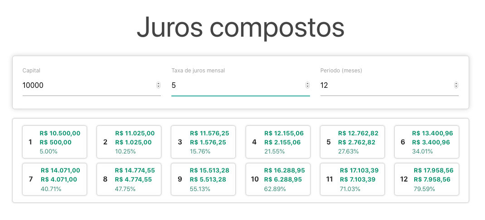

# INSTALLMENT CALCULATOR
---   
## Abstract   
This is a simple application made to learn React. The idea is to to input an amount of money, a positive (appreciation) or negative (depreciation) interest rate (in percentage) and the number of installments to see how this amount of money will behave over the time.
   
## Overview
Here is a screenshot of the application

## A little more about it

### Motivation
This is a simple application made to learn a little bit about React and to practice front-end in general.

### Ingredients
This application uses the yarn package manager and materialize-css module.

### How to run in development mode
First of all, install the modules using yarn. To do this simple run `yarn`. Everything is supposed to run well and everyone will be happy. The next step is to run `yarn start` and the application will start and run in localhost in the port 3000. So Open [http://localhost:3000](http://localhost:3000) to view it in the browser.

### That's it?   
Yep! That's it! Super simple.

## Disclaimer
This is only for study purposes. :)
